<div align="center">

<h1>
  
  Hi, I'm Karel!
</h1>

<!--
  Portrait + info panel are self-hosted animated SVGs (see scripts/).
  370 / 490 keep both columns the same height -- if you change the info card's
  W or H in scripts/make_info_card.py, re-match these widths.
-->
<table>
<tr>
<td valign="top"></td>
<td valign="top"></td>
</tr>
</table>


<br>

<a href="mailto:karelgalindodomingo@gmail.com"></a>
<a href="https://github.com/Elshogu"></a>


</div>

## 💡 About me

Student passionate about **technology, programming, and software development**. I enjoy understanding how systems work and building things that solve real problems.

```javascript
const Karel = {
    passions: ["Technology", "Software Development", "Problem Solving"],
    currentlyLearning: ["Web Development", "System Design", "New Tools & Frameworks"],
    askMeAbout: ["Code", "Tech", "Anything nerdy 🤓"],
    funFact: "I write bugs faster than I fix them... still improving 🚀",
    motto: "Always learning. Always building."
};
```

## 🛠️ Selected work

| Project | What it is | Built with |
| ------- | ---------- | ---------- |
| [**Upp_map**](https://github.com/Elshogu/Upp_map) | Interactive campus map | Expo · React Native · Supabase |
| [**TelegramBot**](https://github.com/Elshogu/TelegramBot) | Telegram bot answering with AI | Java · Docker |
| [**Lleve-Llevele**](https://github.com/Elshogu/Lleve-Llevele) | Point of sale | JavaScript · Python |
| [**wayland-dotfiles**](https://github.com/Elshogu/wayland-dotfiles) | My whole Wayland/Hyprland rice | Lua · Shell · Nix |

## 📈 Contributions

<div align="center">

<!-- self-hosted, refreshed daily by .github/workflows/update-profile-art.yml -->


<br><br>

[](https://git.io/streak-stats)

</div>
